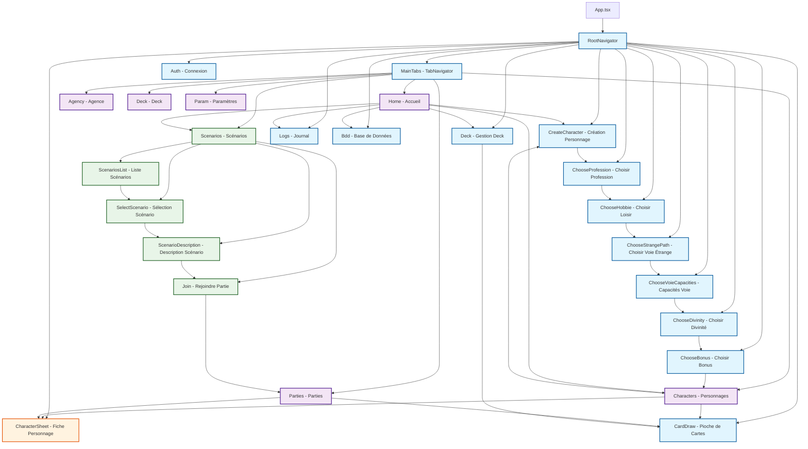

# Diagramme de Navigation - Etrange France

## Structure de Navigation Complète

## Description des Navigations

### 1. Navigation Principale (RootNavigator)
- **Stack Navigator** avec tous les écrans principaux
- Gère l'authentification et la création de personnages
- Contient les écrans de jeu (Deck, CardDraw, etc.)

### 2. Navigation par Onglets (TabNavigator)
- **Bottom Tab Navigator** avec 7 onglets
- Accueil, Personnages, Agence, Scénarios, Parties, Deck, Paramètres
- Chaque onglet peut naviguer vers des écrans de la stack principale

### 3. Navigation des Scénarios (ScenariosNavigator)
- **Stack Navigator** imbriqué dans l'onglet Scénarios
- Flux : Liste → Sélection → Description → Rejoindre

### 4. Flux de Création de Personnage
Séquence linéaire :
1. CreateCharacter → 2. ChooseProfession → 3. ChooseHobbie → 
4. ChooseStrangePath → 5. ChooseVoieCapacities → 6. ChooseDivinity → 
7. ChooseBonus → 8. Retour aux Personnages

### 5. Écrans Modaux
- **CharacterSheet** : Affiché en modal avec animation flip
- Accessible depuis Characters, Parties, etc.

### 6. Points d'Entrée Principaux
- **Home** : Point central avec accès à toutes les fonctionnalités
- **Characters** : Gestion des personnages
- **Scenarios** : Navigation vers les scénarios
- **Parties** : Gestion des parties en cours

## Types de Navigation

1. **Stack Navigation** : Navigation hiérarchique avec retour
2. **Tab Navigation** : Navigation par onglets en bas d'écran
3. **Modal Navigation** : Écrans superposés (CharacterSheet)
4. **Nested Navigation** : ScenariosNavigator dans TabNavigator
